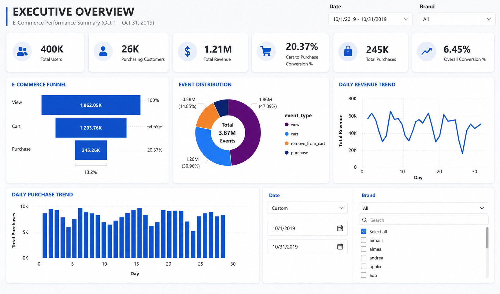
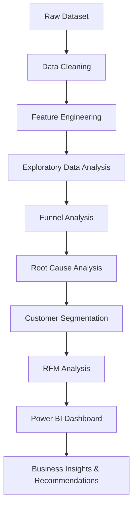
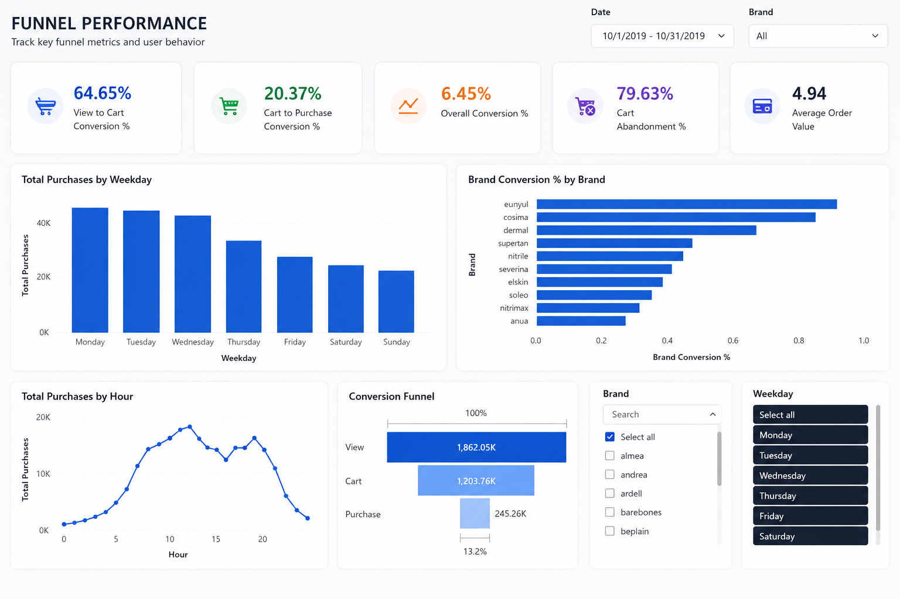
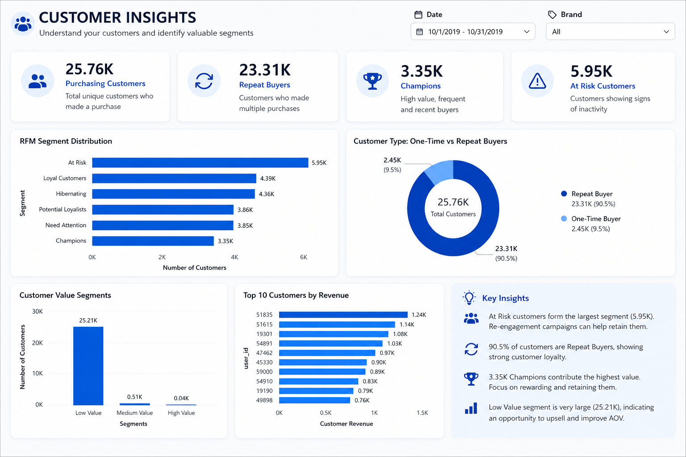
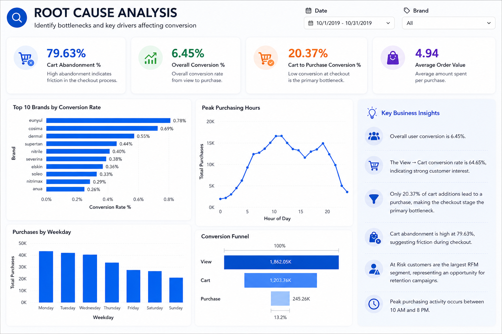

# 📊 E-Commerce Funnel Conversion Analysis

<p align="center">


</p>

An end-to-end **Data Analytics** project that analyzes over **4 million customer interactions** from an e-commerce platform to understand customer behavior across the shopping funnel.

The project combines **Python, SQL, Power BI, and Excel** to clean data, perform exploratory analysis, identify conversion bottlenecks, segment customers using RFM Analysis, and build interactive dashboards that support business decision-making.

---

# 📊 Dashboard Preview

<p align="center">

</p>

---

# 📌 Project Overview

This project analyzes customer interactions throughout the e-commerce shopping journey to identify conversion bottlenecks and generate actionable business insights.

Using Python, SQL, and Power BI, the project follows an end-to-end analytics workflow—from data cleaning and feature engineering to customer segmentation, RFM analysis, and interactive dashboard development.

---

# ⭐ Project Highlights

- 📈 Analyzed **4.1 Million+** customer interaction records.
- 🛒 Measured customer conversion across the shopping funnel.
- 📉 Identified checkout as the primary conversion bottleneck.
- 👥 Segmented customers using purchasing behavior and RFM Analysis.
- 📊 Developed a four-page interactive Power BI dashboard.
- 💡 Delivered business recommendations to improve conversions and customer retention.

---

# 🎯 Business Problem

E-commerce platforms generate millions of customer interactions every day, but not every visitor completes a purchase. Understanding where customers abandon the shopping journey and identifying high-value customer segments are essential for improving conversion rates and revenue.

This project investigates customer behavior across the shopping funnel, uncovers conversion bottlenecks, and provides actionable recommendations through data analysis and interactive dashboards.

---

# 🎯 Business Objectives

- Analyze customer behavior throughout the shopping funnel.
- Measure conversion rates at each funnel stage.
- Identify customer drop-off points.
- Perform Root Cause Analysis for conversion bottlenecks.
- Segment customers based on purchasing behavior.
- Perform RFM Analysis.
- Build an interactive Power BI dashboard.
- Generate actionable business recommendations.

---

# 🛠 Tech Stack

| Category | Technologies |
|----------|--------------|
| Programming Language | Python |
| Data Cleaning | Pandas |
| Database | MySQL |
| Data Visualization | Power BI |
| Spreadsheet | Excel |
| IDE | VS Code |
| Version Control | Git & GitHub |

---

# 📂 Dataset

| Attribute | Details |
|-----------|---------|
| Dataset | October 2019 E-Commerce Events |
| Source | Kaggle |
| Records | 4.1 Million+ |
| Columns | 9 |
| File Format | CSV |

---

# 📁 Data

The project contains two versions of the dataset.

### Raw Data

Original October 2019 e-commerce event dataset downloaded from Kaggle.

### Processed Data

The cleaned dataset after handling missing values, converting data types, and performing feature engineering. This version was used for SQL analysis and Power BI dashboard development.

Additional columns created during preprocessing:

- Date
- Month_name
- Day
- Weekday
- Hour

---

# ⚙️ Project Workflow



---

# 🧹 Data Cleaning & Feature Engineering

The dataset was cleaned and transformed using **Python (Pandas)**.

The following preprocessing steps were performed:

- Removed missing and invalid records
- Converted date columns into datetime format
- Created Date, Hour, Day, Weekday and Month features
- Checked duplicate records
- Prepared the dataset for SQL analysis and dashboard development

---

# 📊 SQL Analysis

The business analysis was divided into six modules:

### Dataset Overview

- Dataset structure
- Missing value analysis
- Event distribution
- Data quality checks

### Exploratory Data Analysis

- Revenue Analysis
- Purchase Distribution
- User Activity
- Brand Analysis
- Time-based Analysis

### Funnel Analysis

- Product Views
- Add-to-Cart Events
- Purchase Events
- View → Cart Conversion
- Cart → Purchase Conversion
- Overall Funnel Performance

### Root Cause Analysis

- Funnel Drop-offs
- Cart Abandonment
- Brand-wise Conversion
- Hour-wise Analysis
- Weekday Analysis

### Customer Segmentation

- Top Customers
- High / Medium / Low Value Customers
- Repeat vs One-Time Buyers

### RFM Analysis

Customer segments include:

- Champions
- Loyal Customers
- Potential Loyalists
- Need Attention
- At Risk
- Hibernating

---

# 📈 Power BI Dashboard

## 📄 Executive Overview

Provides a high-level summary of business performance through KPI cards, revenue trends, event distribution, and funnel metrics.

<p align="center">

</p>

---

## 📄 Funnel Performance

Analyzes customer movement through the shopping funnel and identifies major conversion bottlenecks.

<p align="center">

</p>

---

## 📄 Customer Insights

Visualizes customer segmentation, RFM analysis, repeat buyers, and high-value customers.

<p align="center">

</p>

---

## 📄 Root Cause Analysis

Highlights checkout bottlenecks, purchasing behavior, customer activity, and key business recommendations.

<p align="center">

</p>

---

# 📊 Key Insights

- Overall customer conversion rate: **6.45%**
- View → Cart conversion: **64.65%**
- Cart → Purchase conversion: **20.37%**
- Cart abandonment rate: **79.63%**
- At Risk customers represent the largest RFM segment (**23.10%**).
- Peak purchasing activity occurs between **10 AM and 8 PM**.
- Repeat buyers contribute significantly to overall revenue.

---

# 💡 Business Recommendations

- Simplify the checkout process to reduce cart abandonment.
- Implement abandoned cart recovery campaigns.
- Improve product pages to increase View → Cart conversion.
- Re-engage At Risk customers using personalized marketing campaigns.
- Reward Champions and Loyal Customers through loyalty programs.
- Schedule promotional campaigns during peak purchasing hours.

---

# 📁 Repository Structure

```text
E-Commerce-Funnel-Conversion-Analysis/
│
├── data/
│   ├── raw/
│   │   └── ecommerce.csv
│   │
│   └── processed/
│       └── cleaned_ecommerce.csv
│
├── dashboard/
│   ├── powerbi_dashboard.pbix
│   └── Dashboard.pdf
│
├── images/
│   ├── dashboard_preview.png
│   ├── funnel_performance.png
│   ├── customer_insights.png
│   └── root_cause_analysis.png
│
├── notebooks/
│   └── 01_Data_Cleaning_Feature_Engineering.ipynb
│
├── sql/
│   ├── 01_Dataset_Overview.sql
│   ├── 02_EDA.sql
│   ├── 03_Funnel_Analysis.sql
│   ├── 04_Root_Cause_Analysis.sql
│   ├── 05_Customer_Segmentation.sql
│   └── 06_RFM_Analysis.sql
│
├── README.md
├── requirements.txt
├── LICENSE
└── .gitignore
```

---

# 🚀 Getting Started

1. Explore the data cleaning notebook.
2. Run the SQL scripts to reproduce the analysis.
3. Open the Power BI dashboard (`.pbix`) to interact with the reports.
4. Review the dashboard screenshots and business insights in this repository.

---

# 📚 Skills Demonstrated

### Programming & Data Analysis

- Python
- Pandas
- SQL (MySQL)

### Business Analytics

- Data Cleaning
- Exploratory Data Analysis (EDA)
- Funnel Analysis
- Root Cause Analysis
- Customer Segmentation
- RFM Analysis

### Data Visualization

- Power BI
- Dashboard Development
- Business Intelligence
- Data Storytelling

---

# 🚀 Future Improvements

- Cohort Analysis
- Customer Lifetime Value (CLV)
- Customer Churn Prediction
- Predictive Analytics
- Product Recommendation System
- Sales Forecasting

---

# 👨‍💻 Author

## **Venu T R**

Bachelor of Engineering in Artificial Intelligence and Machine Learning

**Aspiring Data Analyst**

### Skills

- SQL
- Python
- Power BI
- Excel
- Pandas

---

⭐ **If you found this project helpful, consider giving it a Star!**